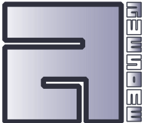

# Awesome AwesomeWM Widgets, Libraries and Modules

 

  

   

- [Awesome AwesomeWM Widgets, Libraries and Modules](#awesome-awesomewm-widgets-libraries-and-modules)
  - [Introduction](#introduction)
  - [The Rules](#the-rules)
  - [Configuration Related](#configuration-related)
    - [Widget Libraries](#widget-libraries)
    - [Projects that Ease Configuration](#projects-that-ease-configuration)
    - [Configuration Transpilers](#configuration-transpilers)
  - [Window Mangement](#window-mangement)
    - [Tag Management](#tag-management)
    - [Focus & Client Navigation](#focus--client-navigation)
    - [Dropdown Clients](#dropdown-clients)
    - [Client Window Launcher](#client-window-launcher)
    - [Client Window Geometry](#client-window-geometry)
    - [Layouts](#layouts)
  - [Environment and System Related](#environment-and-system-related)
    - [Session Related](#session-related)
    - [Tmux Integration](#tmux-integration)
    - [Multimedia](#multimedia)
    - [Laptop Specific](#laptop-specific)
    - [Networking](#networking)
    - [Optical Health](#optical-health)
  - [Keyboard Related](#keyboard-related)
    - [Caps Lock Widgets](#caps-lock-widgets)
    - [Modal Key Binding](#modal-key-binding)
  - [User Interface Related](#user-interface-related)
    - [Animations](#animations)
    - [Notifications](#notifications)
    - [Wibar Related](#wibar-related)
    - [Client Decorations](#client-decorations)
    - [Menu](#menu)
  - [Other Awesome Lists Related to AwesomeWM](#other-awesome-lists-related-to-awesomewm)

<!-- /TOC -->

## Introduction

> blah blah blah Awesome Window Manager blah blah r/unixporn blah blah

Basically, this is a single place to find third party widgets, modules and libraries, however you define them, to add into your own configuration.

## The Rules

1. Project must be intended for use with AwesomeWM in some way
2. Must not be a configuration of AwesomeWM, I am making a list for those too (WIP)
3. Categories are subjective, open to changing them just create an issue and we can discuss

> NOTE: Know of something I didn't list? Awesome, make a pull request with it added or an issue and I will add it.

#### **"tl;dr give me the goods already!"**

Here they are:

## Configuration Related

### Widget Libraries

- [andOrlando's awesome widgets](https://github.com/andOrlando/awesome-widgets)
- [awesome-away](https://github.com/shmilee/awesome-away)
- [awesome-buttons](https://github.com/streetturtle/awesome-buttons)
- [awesome-glorious-widgets](https://github.com/manilarome/awesome-glorious-widgets)
- [awesome-widgets](https://github.com/WillPower3309/awesome-widgets)
- [awesome-wm-widgets](https://github.com/streetturtle/awesome-wm-widgets) \* community favorite
- [awesome-zen](https://github.com/atsepkov/awesome-zen)
- [bling](https://github.com/BlingCorp/bling) \* community favorite
- [cribbed](https://github.com/duckwork/cribbed)
- [fainty](https://github.com/vladimir-g/fainty)
- [Gobo Awesome](https://github.com/gobolinux/gobo-awesome)
- [lain](https://github.com/lcpz/lain) \* community favorite
- [obvious](https://github.com/hoelzro/obvious)
- [radical](https://github.com/Elv13/radical)
- [vicious](https://github.com/vicious-widgets/vicious)

### Projects that Ease Configuration

- [Awesome Awesome RC](https://github.com/suconakh/awesome-awesome-rc)
- [awesome-ezconfig](https://github.com/gvalkov/awesome-ezconfig)
- [awmtt](https://github.com/serialoverflow/awmtt) \*important for beginners!
- [awmtt-ng](https://github.com/basaran/awmtt-ng)
- [aawmtt](https://github.com/Curve/aawmtt)
- [carrot](https://github.com/pouyanh/carrot)
- [noobie](https://github.com/streetturtle/noobie)
- [repetitive](https://github.com/Elv13/repetitive)
- [awesome-ez](https://github.com/jcrd/awesome-ez)
- [Awesome Emmylua](https://github.com/devclyde/awesome-emmylua) \*autocompletion!

### Configuration Transpilers

- [awesomewm.ts.d](https://github.com/saksmt/awesomewm.d.ts) \* for typescript
- [friar](https://github.com/shtwzrd/friar) \* for fennel

<!-- ---------------------------------------------- -->
<!-- ---------------------------------------------- -->
<!-- ---------------------------------------------- -->

## Window Mangement

### Tag Management

- [charitable](https://github.com/frioux/charitable)
- [awesome-sharedtags](https://github.com/Drauthius/awesome-sharedtags)
- [awesome_tagdrag](https://github.com/jorenheit/awesome_tagdrag)
- [awesome infinite](https://github.com/8ware/awesome-infinite)
- [awesome-retain](https://github.com/Veratil/awesome-retain)
- [tyrannical](https://github.com/Elv13/tyrannical)
- [awesome-viewport](https://github.com/jcrd/awesome-viewport)

### Focus & Client Navigation

- [collision](https://github.com/Elv13/collision)
- [awesome-micky](https://github.com/basaran/awesomewm-micky)
- [awesomewm-backham](https://github.com/basaran/awesomewm-backham)
- [awesome-switcher](https://github.com/berlam/awesome-switcher)
  - [awesome-switcher](https://github.com/troglobit/awesome-switcher)
- [awesome_alttab](https://github.com/jorenheit/awesome_alttab)
- [awesome-revelation](https://github.com/bioe007/awesome-revelation)

### Dropdown Clients

- [awesome-handy](https://github.com/crater2150/awesome-handy)
- [awesome-scratch](https://github.com/notnew/awesome-scratch)

### Client Window Launcher

- [awesome-launch](https://github.com/jcrd/awesome-launch)

### Client Window Geometry

- [awesome-remember-geometry](https://github.com/basaran/awesome-remember-geometry)

### Layouts

- [awesome_floattile](https://github.com/jorenheit/awesome_floattile)
- [awesome-frames](https://github.com/notnew/awesome-frames)
- [awesome-overlap](https://github.com/sebth/awesome-overlap)
- [layout-machi](https://github.com/xinhaoyuan/layout-machi)
  - [awesomewm-machina](https://github.com/basaran/awesomewm-machina)
- [awesome-dovetail](https://github.com/jcrd/awesome-dovetail)
    <!-- ---------------------------------------------- -->
    <!-- ---------------------------------------------- -->
    <!-- ---------------------------------------------- -->
    

## Environment and System Related

### Session Related

- [gobo-awesome-screenlock](https://github.com/gobolinux/gobo-awesome-screenlock)
- [awesome-wallpaper](https://github.com/JavaCafe01/awesome-wallpaper)
- [dash-widgets](https://github.com/eylles/dash-widgets)

### Tmux Integration

- [awesome-termgrp](https://github.com/wheatdog/awesome-termgrp)
- [awesomewm-vim-tmux-navigator](https://github.com/intrntbrn/awesomewm-vim-tmux-navigator)

### Multimedia

- [awesome-pa-utility](https://github.com/lealoureiro/awesome-pa-utility)
- [awesome-pulseaudio_widget](https://github.com/stefano-m/awesome-pulseaudio_widget)
- [alsa-volume-monitor](https://github.com/gch1p/alsa-volume-monitor)

### Laptop Specific

- [xplugd](https://github.com/troglobit/xplugd)
- [awesome_batterywidget](https://github.com/jorenheit/awesome_batterywidget)
- [awesome-upower-battery](https://github.com/berlam/awesome-upower-battery)
- [awesome-light](https://github.com/troglobit/awesome-light)

### Networking

- [awesome-connman_widget](https://github.com/stefano-m/awesome-connman_widget)
- [net_widgets](https://github.com/pltanton/net_widgets)

### Optical Health

- [awesome-redshift](https://github.com/troglobit/awesome-redshift)

    <!-- ---------------------------------------------- -->
  <!-- ---------------------------------------------- -->
  <!-- ---------------------------------------------- -->
    

## Keyboard Related

- [keyboard_layout](https://github.com/echuraev/keyboard_layout)

### Caps Lock Widgets

- [awesomewm-capslock_widget](https://github.com/iacchus/awesomewm-capslock-widget)
- [awesomewm-capslock_widget](https://github.com/stefano-m/awesome-capslock_widget)

### Modal Key Binding

- [awesome-modalbind](https://github.com/crater2150/awesome-modalbind)
- [modalawesome](https://github.com/potamides/modalawesome)

<!-- ---------------------------------------------- -->
<!-- ---------------------------------------------- -->
<!-- ---------------------------------------------- -->
## User Interface Related

### Animations

- [awesome-AnimationFramework](https://github.com/Aire-One/awesome-AnimationFramework)
- [awestore](https://github.com/K4rakara/awestore)
- [rubato](https://github.com/andOrlando/rubato)

### Notifications

- [AwesomeWM Memory Notifier plug-in](https://github.com/macunha1/awesomewm-memory-notifier)

### Wibar Related

- [bar](https://github.com/wezm/bar)
- [fenetre](https://github.com/cool-cool-sweat/fenetre)
- [icon_customizer](https://github.com/intrntbrn/icon_customizer)

### Client Decorations

- [farbig](https://github.com/Nooo37/farbig)
- [color](https://github.com/andOrlando/color)
- [awesomePalettes](https://github.com/nivalderramas/awesomePalettes)
- [nice](https://github.com/mut-ex/awesome-wm-nice)
- [smart_borders](https://github.com/intrntbrn/smart_borders)

### Menu

- [awesomewm-app-drawer](https://github.com/nwdamgaard/awesomewm-app-drawer)
- [awesome-freedesktop](https://github.com/lcpz/awesome-freedesktop) \*community favorite
- [awesome-appmenu](https://github.com/montagdude/awesome-appmenu)
- [Start View](https://github.com/gnomengineer/StartView)
- [AwesomeWM Gnome Menu](https://github.com/albel727/awesomewm_gnome_menu)

## Other Awesome Lists Related to AwesomeWM

- [Awesome AwesomeWM](https://github.com/atsepkov/awesome-awesome-wm)
